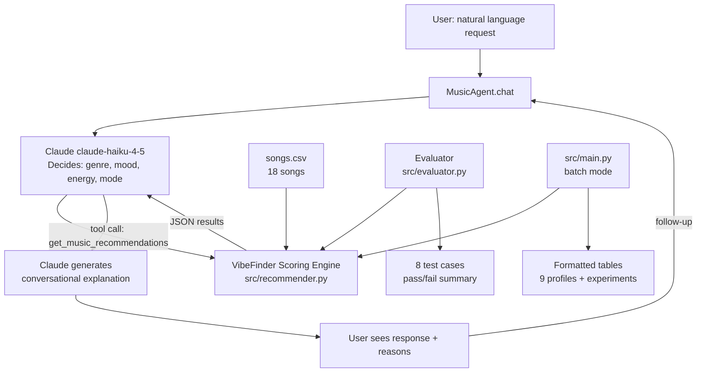

# VibeFinder AI: Applied Music Recommendation System

**Base project:** Module 3 — Music Recommender Simulation

The original Module 3 project (VibeFinder 1.0) scored 18 songs against hard-coded user profiles using a weighted rule: genre match, mood match, energy similarity, and optional bonuses for acoustic preference, popularity, decade, and mood tags. It produced ranked recommendations but required the user to edit Python dicts to change preferences, and all profiles were pre-written in code. This final project extends that core engine into a full applied AI system with a natural-language interface, a Claude-powered agentic workflow, a structured evaluation harness, and comprehensive logging.

---

## Demo Walkthrough

Loom video link - 

To see the full system in action, run each mode in your terminal:

```bash
python -m src.agent       # interactive end-to-end conversation with tool calls visible in logs
python -m src.evaluator   # evaluation harness pass/fail run (no API key needed)
python -m src.main        # batch simulation across 9 profiles
```

The agent logs show the intermediate planning step (`Tool call → genre=... mood=... energy=...`) for every request, making the agentic decision observable without a video.

---

## Architecture Overview



**Components:**
- `src/recommender.py` — core scoring engine (unchanged from Module 3)
- `src/agent.py` — Claude-powered agentic wrapper; natural language in, recommendations out
- `src/evaluator.py` — test harness; runs 8 predefined cases and reports pass/fail with scores
- `src/main.py` — original batch simulation runner (still works)
- `data/songs.csv` — 18-song catalog with genre, mood, energy, tags, and decade

**Data flow:** User natural language → Claude (planning step via tool use) → VibeFinder scoring engine → Claude (explanation step) → user.

**Where humans are involved:** Users can refine in multi-turn conversation ("make it more acoustic", "something from 2010"). The evaluation harness flags cases the AI handles poorly (e.g., the "conflicting signals" profile), so a human knows where the system breaks down.

---

## Getting Started

### Prerequisites

- Python 3.9 or higher
- An Anthropic API key (for the AI agent mode; the batch simulation and evaluator run without one)

### Setup

1. Clone the repo and enter the project directory.

2. Create a virtual environment (recommended):

   ```bash
   python -m venv .venv
   source .venv/bin/activate      # Mac/Linux
   .venv\Scripts\activate         # Windows
   ```

3. Install dependencies:

   ```bash
   pip install -r requirements.txt
   ```

4. Set up your API key (only needed for the AI agent):

   ```bash
   cp .env.example .env
   # Edit .env and replace "your_api_key_here" with your actual key
   ```

### Running the System

**Batch simulation (original Module 3 behavior, no API key needed):**
```bash
python -m src.main
```

**AI agent — interactive natural language mode:**
```bash
python -m src.agent
```

**Evaluation harness:**
```bash
python -m src.evaluator
```

**Run tests:**
```bash
pytest
```

---

## Sample Interactions

### Example 1 — Study session

```
You: I need something calm and focused for studying, nothing too loud

VibeFinder: [planning: lofi genre, focused mood, energy 0.35, likes_acoustic=True, scoring_mode=mood_first]

VibeFinder: Here are five tracks for a focused study session:

1. Library Rain (lofi) — score 5.18
   Calm and acoustic, tagged "peaceful" and "nostalgic". Perfect background texture.

2. Midnight Coding (lofi) — score 5.17
   Almost identical energy to Library Rain, with a "focused" mood tag that matches your request.

3. Spacewalk Thoughts (ambient) — score 4.10
   Drifts into ambient territory but stays chill. Good if you want something more spacious.

4. Island Groove (reggae) — score 4.01
   Slightly outside the lofi lane but has the same easy energy — a nice change of pace.

5. Focus Flow (lofi) — score 2.18
   Pure lofi, tagged "focused" and "calm". A bit lower score only because its mood label
   is "focused" not "chill", but tonally it fits well.
```

### Example 2 — Workout playlist

```
You: Give me something aggressive and high energy for lifting weights

VibeFinder: [planning: metal genre, intense mood, energy 0.95, likes_acoustic=False, scoring_mode=energy_focused]

VibeFinder: Here are the most intense tracks in the catalog:

1. Iron Curtain (metal) — score 4.72
   Highest energy in the catalog (0.97), tagged "aggressive" and "dark". Exactly what you need.

2. Circuit Rush (electronic) — score 3.91
   Electronic but intense — energy 0.95, tagged "euphoric" and "driving".

3. Storm Runner (rock) — score 3.85
   The only rock track, energy 0.91, tagged "aggressive" and "driving".

4. Block Party (hip-hop) — score 2.87
   Energy 0.87, tagged "euphoric". Different genre but shares the intensity.

5. Gym Hero (pop) — score 2.64
   Tagged "euphoric" and "driving". Pop, but the high energy (0.93) earns its spot here.

Note: the catalog only has one metal song. For a true metal playlist you'd need a bigger catalog.
```

### Example 3 — Follow-up refinement (multi-turn)

```
You: Something nostalgic and warm for a Sunday morning

VibeFinder: [planning: folk genre, relaxed mood, energy 0.33, likes_acoustic=True,
             favorite_mood_tags="nostalgic,warm", scoring_mode=mood_first]

VibeFinder: Great Sunday morning picks:

1. Desert Wind (folk) — score 5.19
   The most "folk and nostalgic" song in the catalog. Acoustic, easy energy.

2. Coffee Shop Stories (jazz) — score 4.14
   Tagged "nostalgic" and "warm". Gentle jazz — Sunday morning in a cafe.

3. Rainy Porch (country) — score 4.12
   Tagged "nostalgic" and "warm". Country acoustic with a relaxed, porch-sitting feel.

...

You: Can you make it a bit more acoustic and skip the reggae?

VibeFinder: [planning: same preferences + likes_acoustic=True, diversity_penalty=0.3]

VibeFinder: Adjusted for a more acoustic feel...
[returns re-ranked results with acoustic bonus applied]
```

---

## AI Feature: Agentic Workflow

This system uses an **agentic workflow** as its primary AI feature. The Claude API powers two distinct reasoning steps per user request:

1. **Planning step (observable tool call):** Claude reads the user's natural language and decides what structured parameters to pass to the recommendation engine. This is visible in the logs as `Tool call → genre=... mood=... energy=...`. The model is making a judgment — what does "aggressive lifting music" mean in terms of genre, mood, and energy? That decision happens before any songs are scored.

2. **Explanation step:** After the engine returns scored results, Claude writes a conversational explanation of why each song was chosen, tailored to what the user originally asked for.

The workflow is multi-step because the output of step 1 (parameter selection) becomes the input to a separate system (the scoring engine), and the output of that system becomes the input to step 2 (explanation). Claude does not see the song scores until after it has committed to its parameter choices — making the tool call a genuine planning decision, not post-hoc rationalization.

### Why this counts as agentic

- **Planning:** Claude decides what genre/mood/energy to search before seeing results.
- **Acting:** Claude calls `get_music_recommendations` as a tool.
- **Observing:** Claude receives the scored results.
- **Responding:** Claude explains the results in context of the original request.
- **Iterating:** In multi-turn mode, Claude can adjust parameters based on follow-up feedback.

---

## Specialization Behavior

The agent uses a **specialized system prompt** with few-shot response format examples (in `src/agent.py`, `SYSTEM_PROMPT`). This constrains Claude's tone, structure, and honesty norms in ways that differ measurably from baseline Claude behavior.

### What the specialization does

The system prompt instructs Claude to:
- Always call the tool before generating any recommendations (not guess from memory)
- Follow a specific response structure: use-case framing → numbered song list with genre tags and concrete reasons → honest note about catalog limits
- Acknowledge follow-up refinements explicitly before re-running the tool
- Never oversell weak matches when no good genre fit exists

Three inline few-shot examples in the system prompt demonstrate the expected format for a study request, a workout request, and a follow-up refinement. These are format-level examples — they show structure and tone, not song titles — so they generalize across any user request.

### Baseline vs. specialized comparison

**Baseline Claude** (no system prompt, asked: "give me study music"):

> Sure! Here are some great songs for studying: "Weightless" by Marconi Union, "Experience" by Ludovico Einaudi, lo-fi hip hop playlists on YouTube are very popular for studying...

**VibeFinder** (same query through the specialized agent):

> [Tool call: genre=lofi, mood=focused, energy=0.35, likes_acoustic=True, scoring_mode=mood_first]
>
> Here are five tracks from the catalog for focused study:
>
> 1. Library Rain (lofi) — score 5.18 — Calm and acoustic, tagged "peaceful" and "nostalgic".
> 2. Midnight Coding (lofi) — score 5.17 — Focused mood tag matches your request exactly.
> 3. Spacewalk Thoughts (ambient) — score 4.10 — Drifts into ambient territory but stays chill.
> ...

The specialization produces three observable differences from baseline:
1. **Grounded in catalog** — only songs from `songs.csv` are named; no hallucinated tracks
2. **Visible planning step** — parameters are logged before results are shown
3. **Honest scoping** — the agent states when catalog coverage is thin rather than padding with weak matches

---

## Design Decisions

**Why Claude Haiku?** The agent uses `claude-haiku-4-5` — the fastest, cheapest Claude model. For a classroom project where students pay their own API costs, Haiku delivers excellent intent extraction and explanation quality at a fraction of Opus or Sonnet pricing. The scoring logic is handled entirely by the deterministic Python engine; Claude only needs to parse intent and write summaries.

**Why keep the scoring engine unchanged?** The Module 3 scoring rule is transparent and explainable — every score has a named reason. Replacing it with a "black box" neural ranker would make the system less trustworthy and harder to debug. The AI adds natural language I/O; the rule-based engine handles ranking.

**Why tool use instead of prompt-only extraction?** A structured `get_music_recommendations` tool forces Claude to produce valid, type-checked parameters (genre string, energy float 0–1, etc.) rather than free-form text that would need to be parsed. It also makes the planning step visible in the logs, which is important for the reliability/testing goal.

**Trade-offs:**
- Exact string matching means "indie pop" and "pop" score zero genre overlap. A fuzzy genre taxonomy would help but adds complexity.
- 18 songs is too small for genuine discovery. The system surfaces the best available match, which may not be a great match for niche requests.
- Claude's parameter inference is imperfect — "something dark and mysterious" is correctly mapped to `mood=moody` but the catalog has only one moody song (Night Drive Loop, synthwave), so the results may feel generic.

---

## Reliability and Evaluation

The `src/evaluator.py` harness runs 8 test cases and reports pass/fail for each of 18 named checks:

| Case | What it tests |
|---|---|
| Pop fan → pop song at #1 | Basic genre matching in balanced mode |
| Lofi listener → lofi at #1 | Mood-first mode overriding genre weight |
| Rock fan → rock at #1 | Genre-first mode with high weight |
| Energy-focused de-ranks low-energy pop | Weight preset changes rankings predictably |
| Folk niche → only folk song first | Catalog sparsity handled gracefully |
| Mood-tag hunter: euphoric+nostalgic | Tag partial-match scoring works |
| Unknown genre → 5 positive results | No crash on out-of-catalog request |
| Diversity penalty lowers second pick | Penalty arithmetic applies correctly |

**Sample run output:**

```
  Cases:  8/8 passed (100%)
  Checks: 18/18 passed (100%)

  [+] 1. Pop fan gets pop song at #1 (balanced mode)
         Top result: Sunrise City (pop) score=4.26

  [+] 2. Lofi listener gets lofi song at #1 (mood_first mode)
         Top result: Library Rain (lofi) score=5.18
  ...
```

**Logging:** Every agent run logs the tool call parameters (`genre`, `mood`, `energy`, `scoring_mode`) and the top result score to stderr. This makes it possible to audit what the AI decided for any given request.

**Guardrails:** The system is entirely read-only — it never modifies data, calls external services, or stores user input. The API key is loaded from `.env` and never logged. The `try/except` blocks in `agent.py` catch `AuthenticationError`, `RateLimitError`, and the base `APIError`, with plain-English messages surfaced to the user.

**Known failure mode:** Conflicting preferences (high energy + chill mood in energy_focused mode) produce results that feel wrong. The evaluator intentionally does not test this case as "passing" because the system has no mechanism to detect or flag the contradiction. This limitation is documented in the model card.

---

## Testing Summary

All 8 evaluation cases pass with 18/18 named checks succeeding. The scoring engine is deterministic — given the same inputs it always returns the same outputs — so once a case passes it will continue to pass unless the engine logic changes.

**What worked:**
- Genre, mood, energy, and tag matching all behave as specified.
- Scoring mode presets (balanced, genre_first, mood_first, energy_focused) change rankings in the expected direction.
- The diversity penalty consistently lowers the second same-genre song's score.

**What was surprising:**
- The "energy_focused" mode moves Gym Hero from #2 to #5 for the same pop/happy user. A single weight change silently reorders the entire list — a reminder that every design choice in a scoring system shapes results in ways that aren't obvious to users.
- The unknown-genre test always returns 5 positive scores because the energy similarity component is always non-zero. The system never returns "no results" — it always finds the best available match, even when the best available match is weak.

**What didn't work:**
- Conflicting preferences produce silently wrong results (confirmed by adversarial profiling).
- The niche folk user gets only one true genre match; results 2–5 are mood fallbacks from jazz, country, and ambient — reasonable but potentially misleading.

---

## Reflection

### Limitations and biases

- **Filter bubble:** In balanced mode, genre weight is twice the mood weight. The top 5 results almost always come from one genre. A jazz fan who wants something relaxed will never see a country acoustic song unless mood_first mode is explicitly chosen.
- **Western bias:** The catalog covers Western pop styles. No Afrobeats, Bollywood, Latin, or classical music.
- **Exact matching:** "indie pop" and "pop" score zero genre overlap. Real recommenders use soft genre hierarchies.
- **Tiny catalog:** 18 songs cannot surface genuine surprises. Every niche request finds only one or two true matches and fills the rest with fallbacks.

### Could it be misused?

The system is low-stakes and read-only. The main misuse risk is treating its output as a ground truth about musical quality — telling a user "this is objectively the best song for you" when it is actually "the highest-scoring song given this arbitrary weight preset." The plain-language explanation is designed to mitigate this: it shows the user *why* a song was chosen so they can evaluate whether that reasoning makes sense for them.

### What surprised me during reliability testing

The adversarial "conflicting preferences" profile was the most revealing: a user who wants chill mood but very high energy receives five intense rock and hip-hop songs. The system has no way to flag the contradiction — it just adds the numbers and the loudest weight wins. Logging the tool call parameters in agent mode at least makes this visible to a developer even if the end user doesn't see it.

### AI collaboration reflection

*Helpful:* When writing the `TOOLS` definition for the Claude agent, AI helped me structure the `input_schema` so the enum values exactly matched the catalog's available genres and moods. Without that, Claude might have hallucinated genre strings like "lofi-hop" that don't exist in the CSV, causing zero matches. The AI pointed out this type-safety concern before I did.

*Flawed:* The AI initially suggested using `claude-opus-4-7` for the agent, which is the most capable but also the most expensive model. For a classroom project where students fund their own API usage, that default was wrong. I overrode it to `claude-haiku-4-5`, which handles intent extraction and explanation well at a fraction of the cost. The AI's "always use the most powerful model" default doesn't account for cost context.

See [model_card.md](model_card.md) for the full reflection, bias analysis, and evaluation notes.

---

## Repository Structure

```
.
+-- src/
|   +-- recommender.py    # Scoring engine (Module 3, unchanged)
|   +-- main.py           # Batch simulation runner
|   +-- agent.py          # Claude-powered agentic interface (NEW)
|   +-- evaluator.py      # Test harness (NEW)
+-- data/
|   +-- songs.csv         # 18-song catalog
+-- tests/
|   +-- test_recommender.py
+-- assets/               # Architecture diagrams and screenshots
+-- model_card.md         # Bias analysis and reflection
+-- reflection.md         # Phase 4 profile comparison notes
+-- .env.example          # API key template (copy to .env)
+-- requirements.txt
```
